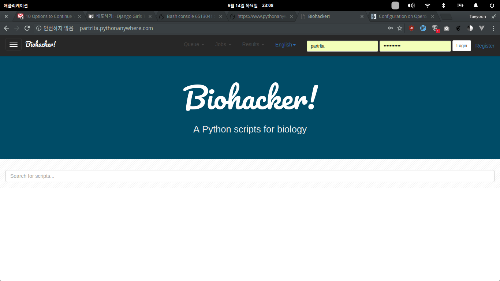

# Wooey for pythonanywhere.com
> A web ui for python scripts
<!-- 
[![NPM Version][npm-image]][npm-url]
[![Build Status][travis-image]][travis-url]
[![Downloads Stats][npm-downloads]][npm-url] -->

[Wooey](https://github.com/wooey/Wooey) is a easy way to get your scripts up on the web for routine data analysis, file processing, or anything else.  


This is [my demo](http://partrita.pythonanywhere.com)


## Installation
Read [this](http://wooey.readthedocs.io/en/latest/install.html) before you start.

### 1. Edit `user_settings.py` file in <your-wooey-project> directory
```
ALLOWED_HOSTS = (
    'localhost',
    '127.0.0.1',
    ".pythonanywhere.com")
```

### 2. Git clone at `pythonanywhere` bash console

```bash
git clone https://github.com/<your-github-username>/<your-git-repo-name>.git
```
Beware of inside of < and >.

### 3. Install `wooey` at `pythonanywhere` bash console

```bash
$ cd <your-git-repo-name>
$ virtualenv --python=python3 myvenv
$ source myvenv/bin/activate
(myvenv) $  pip install wooey
```
It takes a time.

### 4. Make superuser and database at `pythonAnywhere`

```bash
(mvenv) $ python manage.py createsuperuser
(mvenv) $ python manage.py migrate
```

### 5. Add a new web app
1. Pythonanywhere dashboard
2. Click the `Web` 
3. Add a new web app
4. Set your domain name
5. Select manual configuration
6. Select Python 3.4 (This is latest version at 2018/6/14)
7. Click `Next` button
8. Setup wizard will closed 

### 6. Set `virtualenv`
1. In Virtualenv section
2. Click the `Enter the path to a virtualenv`
3. Input /home/<your-username>/<your-git-repo-name/myvenv/
4. Click the blue check button

### 7. Set WSGI file 
Wooey(based on Django) works with WSGI protocol. This is standard protocols for python web app. 

1. At Code section, there is `/var/www/<your-username>_pythonanywhere_com_wsgi.py` link
2. Click the link
3. Delete everything
4. Copy and paste below code (beware of <>)

```python
import os
import sys

path = '/home/<your-PythonAnywhere-username>/<your-git-repo-name></your-git-repo-name>'  # PythonAnywhere 계정으로 바꾸세요.
if path not in sys.path:
    sys.path.append(path)

os.environ['DJANGO_SETTINGS_MODULE'] = '<your-wooey-project-name>.settings'

from django.core.wsgi import get_wsgi_application
from django.contrib.staticfiles.handlers import StaticFilesHandler
application = StaticFilesHandler(get_wsgi_application())
```
Save this file

### 8. Click the reload button
If there is error, you shold check the error log.

## Meta

Momore hatz – [Blog](https://partrita.github.io)

<!-- Markdown link & img dfn's -->
<!-- [npm-image]: https://img.shields.io/npm/v/datadog-metrics.svg?style=flat-square
[npm-url]: https://npmjs.org/package/datadog-metrics
[npm-downloads]: https://img.shields.io/npm/dm/datadog-metrics.svg?style=flat-square
[travis-image]: https://img.shields.io/travis/dbader/node-datadog-metrics/master.svg?style=flat-square
[travis-url]: https://travis-ci.org/dbader/node-datadog-metrics
[wiki]: https://github.com/yourname/yourproject/wiki -->